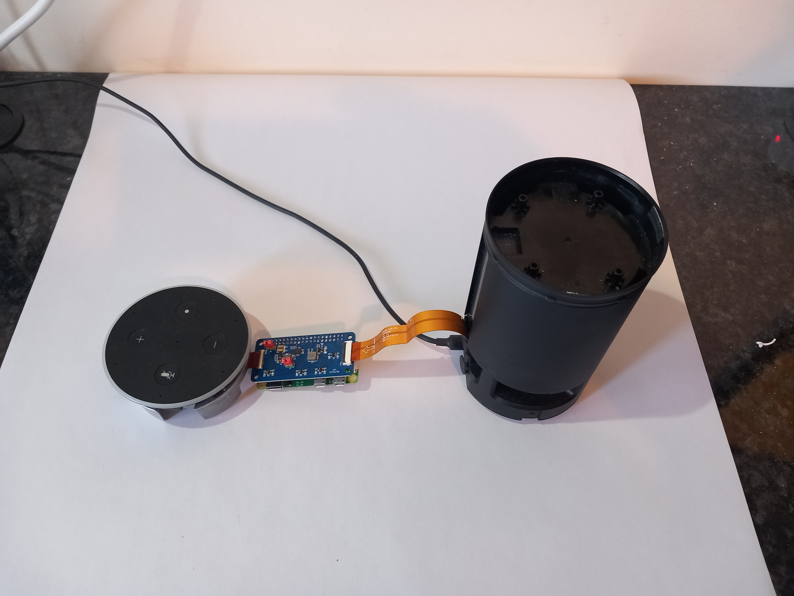
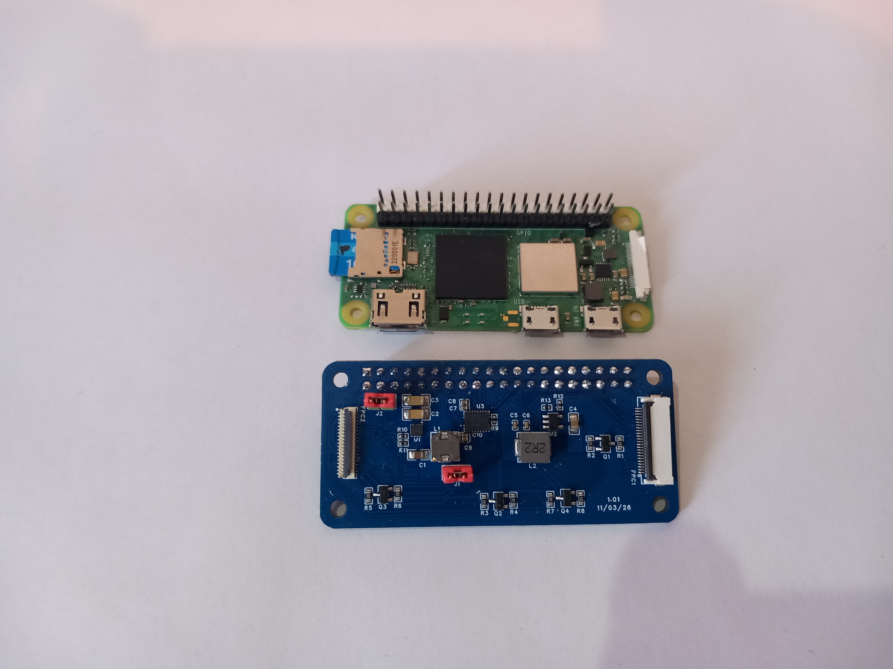
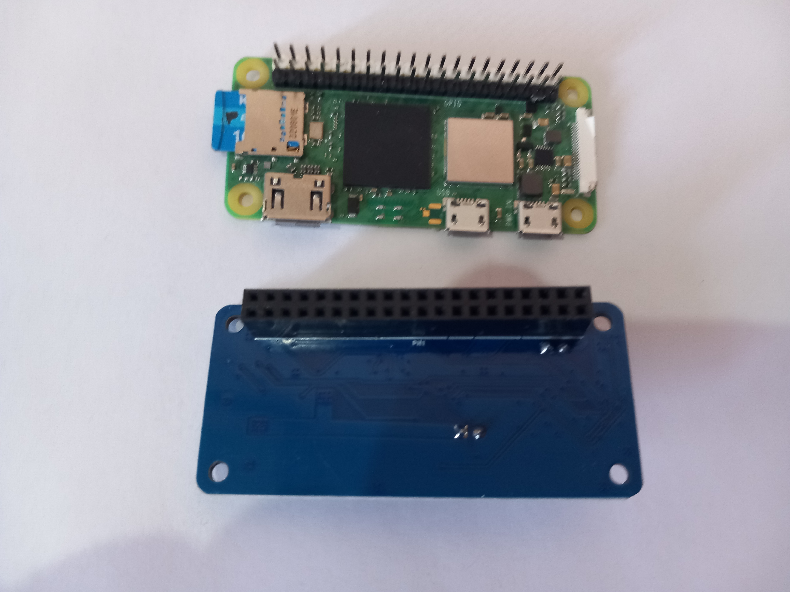
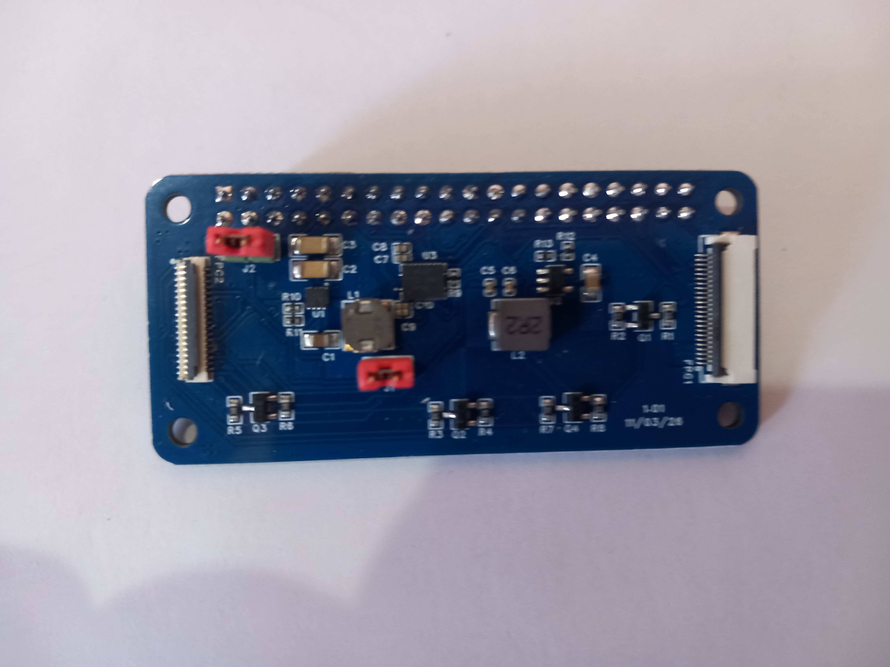

# Retasking a 2nd Gen Amazon Echo


A collection of data and code to retask various parts of a
2<sup>nd</sup> generation Echo.

## Pi Zero 2W "Soundcard"

 
 

All of the files required to build the the device pictures above are located in the [Documents folder](Documents). Installation instructions are at the end.

You can use a company such as PCBWay or JLPCB to build the card. Fill in the form and attach the BOM (Bill Of Materials), GERBER (PCB fabrication) and PickAndPlace (component placement) files.

With this board you can:
1. Record from up to 2 microphones on the Echo.
2. Play audio through the Echo Speaker
3. Control/Animate the LEDS
4. Disable the microphones (Red LED turns on)
5. Disable./Enable audio output.
6. Detect presses of VOL+, VOL-, ATTN and PRIVACY buttons.

### \*\*\* DO NOT BUILD THIS \*\*\*

As the title says, do not build this - you will be disappointed.

There are several issues with this device and nearly all can be overcome, but not all of them.

#### Audio hiss

When enabled, the audio output hisses and pops when the Pi accesses the sdcard or WiFi.
The reason for this is because I've used PWM (via GPIOs 12 and 13) and these are susceptable to interference. As an experiment I used the Pi Zero on its own and connected GPIOs 12 and 13 to an external amplifier. The interference was still there which makes me think it is an issue with the Pi Zero and not the board. Other Pis, such as the Pi 4 did not appear to noticably suffer from this issue.

This can be resolved by using digital audio output and putting that through a DAC, but this requires a redesign.

#### TVL320ADC3101 (ADC) Driver limitations

The 7 microphones are attached to 4 [TLV320ADC3101](https://www.ti.com/product/TLV320ADC3101) ADCs. The Linux kernel has a driver for this ADC and I have copied the source code (unmodified) into [driver/src](driver/src) directory (build instructions are below). Unfortunately, there are several issues with using this driver with more than 2 microphones and/or more than one TLV320ADC3101.

1. Initialisation<br>
  At initialisation the ADCs have to have the RESET pin (GPIO 17) driven low for at least 10ns.
  The driver assumes that each ADC has a seperate GPIO to RESET the chip. This is not the case with the Echo board. All RESETs are connected to the same GPIO. As a result, when the second ADC is being initialised it also resets the first so any configuration on the first ADC is lost.
2. Channel Offset<br>
  In order to use more than 2 channels the ADC has to be configured to offset the audio a set number of bits after the frame cycle has been received. For example, using 4 channels of 16 bits, the first ADC would put its 1st channel at offset 0, its 2nd at offset 16 and the second ADC would put its 1st at offset 32 and its 2nd at offset 48.
  The ADCs support this functionality but the driver does not implement it.
3. Clock generation.<br>
  The ADCs use various dividers and mulitpliers to set internal timing. The driver assumes there are only 2 channels at most so if more than 2 channels are being used some of the internal settings can be miscalculated resulting in garbage output.

All of these can be overcome by redesigning and customising the driver for the Echo board.

#### Simple Audio Card

For the sound card driver I'm using the "simple audio card" driver provided by the kernel and configuring it via an overlay. This does not appear to handle more than one ADC and can not incorporate the volume and privacy buttons (GPIO 5,6, and 26) and Jack sense (GPIO 24).

A custom audio card driver could be developed to overcome this.

#### Raspberry Pi Limitations

All Raspberry Pis have a maximum of 64 bits of data for the I2S audio input and another maximum of 64 bits for the audio output.

As a result, if all 7 microphones are to be used then they would be limited to 8 bits per channel. This is not a high enough resolution for reliable speech-to-text.

There is no resolution to this problem.

### GPIOs

| GPIO | Mode | Description |
| ---- | ---- | ----------- |
|  2 | a0 | SDA1
|  3 | a0 | SCL1
|  4 | a0 | GPCLK0
|  5 | ip | Volume- Button. Pulled low when pressed
|  6 | ip | Volume+ Button. Pulled low when pressed
|  7 | x  | Unused
|  8 | x  | Unused
|  9 | x  | Unused
| 10 | op | Audio output control. See below
| 11 | op | Audio output control. See below
| 12 | a0 | PWM0 - Audio output
| 13 | a0 | PWM1 - Audio output
| 14 | x  | Unused
| 15 | x  | Unused
| 16 | ip | ATTN Button. Pulled low when pressed
| 17 | op | RESET - Drive low to reset the microphone ADCs
| 18 | a0 | PCM_CLK - I2S
| 19 | a0 | PCM_FS - I2S
| 20 | a0 | PCM_DIN - I2S
| 21 | x  | Unused
| 22 | op | Audio output control. See below
| 23 | op | MICMUTE. Drive high to disable microphones.
| 24 | ip | JACK Sense. Goes low when jack plugged in.
| 25 | op | OE - Drive high to enable one of the logic level shifters
| 26 | ip | PRIVACY Button. Pulled low when pressed.
| 27 | op | ENABLE - Drive high to enable LED ring

#### Audio output control

There are three GPIOs that control audio output. If GPIO 10 is high and GPIO 11 is low then
the speakers are on and audio can be played. Any other combination and the speakers are disabled.
If GPIO 10 is used to enable/disable the speakers then there is a 'pop' when they are enabled.
If GPIO 11 is used the the transition from disabled to enabled is much smoother so I recommend you use this rather than 10.

The third GPIO is GPIO 22. Changing this has little effect but the Echo control board drives this line low when audio is playing through the jack so I recommend you do the same.

## Installing

These instructions are based upon 64-bit Raspbian Lite OS version 13 (Trixie).

You will need the following:

1. Upgrade and install required packages
```
sudo apt update
sudo apt upgrade
sudo apt install git i2c-tools libi2c-dev dkms

```
2. Clone the repository and cd into it.
```
git clone https://github.com/SynAckFin/Echo-Retasker.git
cd Echo-Retasker

```
3. Build and install the ADC driver
```
cd driver
sudo make install
cd ..

```
4. Add `i2c-dev` to the modules to be loaded:
```
echo i2c-dev |sudo tee /etc/modules-load.d/10-i2c-dev.conf

```

5. Edit `/boot/firmware/config.txt` and add the following to the end:
```
# Setup i2c and audio
dtparam=i2c_arm=on
dtparam=i2s=on
dtoverlay=audremap,pins_12_13
gpio=12=a0
gpio=13=a0
# Turn the speakers off
gpio=10=op,dh
# Needs to be set to enable speaker output
gpio=11=op,dh
gpio=22=op,dh

# Setup GPIOs for the buttons
# Volume down
gpio=5=ip,pu
# Volume up
gpio=6=ip,pu
# Attention
gpio=16=ip,pu
# Privacy
gpio=26=ip,pu

# Enable to LED ring
gpio=27=op,dh,pd
# Turn off privacy (enable microphones)
gpio=23=op,dl,pd
# Enable one of the level shifters
gpio=25=op,dh,pu
# Load the sound card
dtoverlay=echo-2mic

```
6. Reboot for changes to take effect

7. Build and test the LED ring app.
```
cd Echo-Retasker/ledring
make
./ledring test
cd ..

```
8. Configure the audio (only needs to be done once)
```
alsactl --no-ucm -f driver/asound.conf restore echo2micvoiceca

```
9. Record 30 seconds of audio to test microphones
```
arecord -D plughw:CARD=echo2micvoiceca,DEV=0 -r 16000 -c 2 -f S16_LE -t wav -d 30 test.wav

```
10. Test audio output.
```
# Set volume
amixer set PCM  70%
# Enable audio output
pinctrl 11 dl
# Play the recording
aplay test.wav
# Disable audio output
pinctrl 11 dh

```


