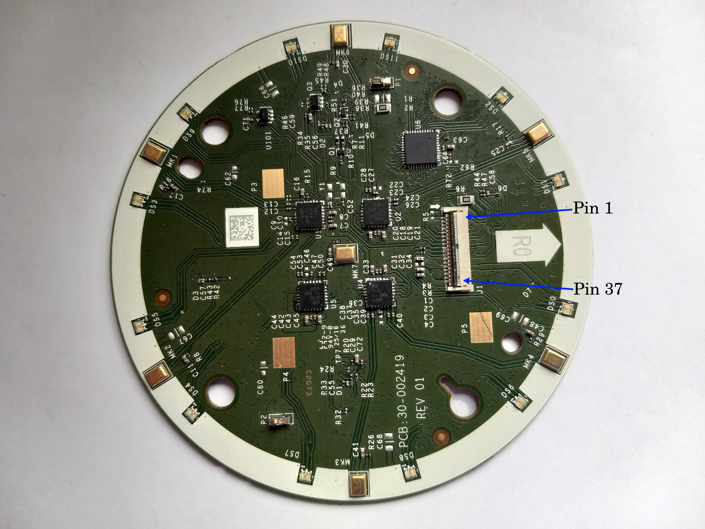
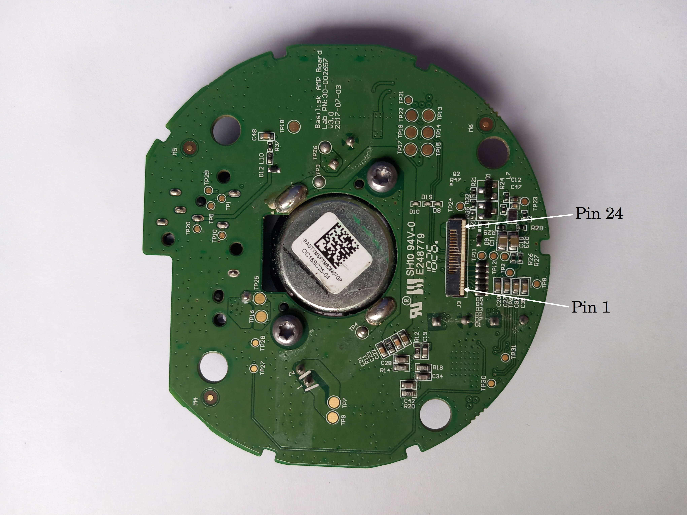
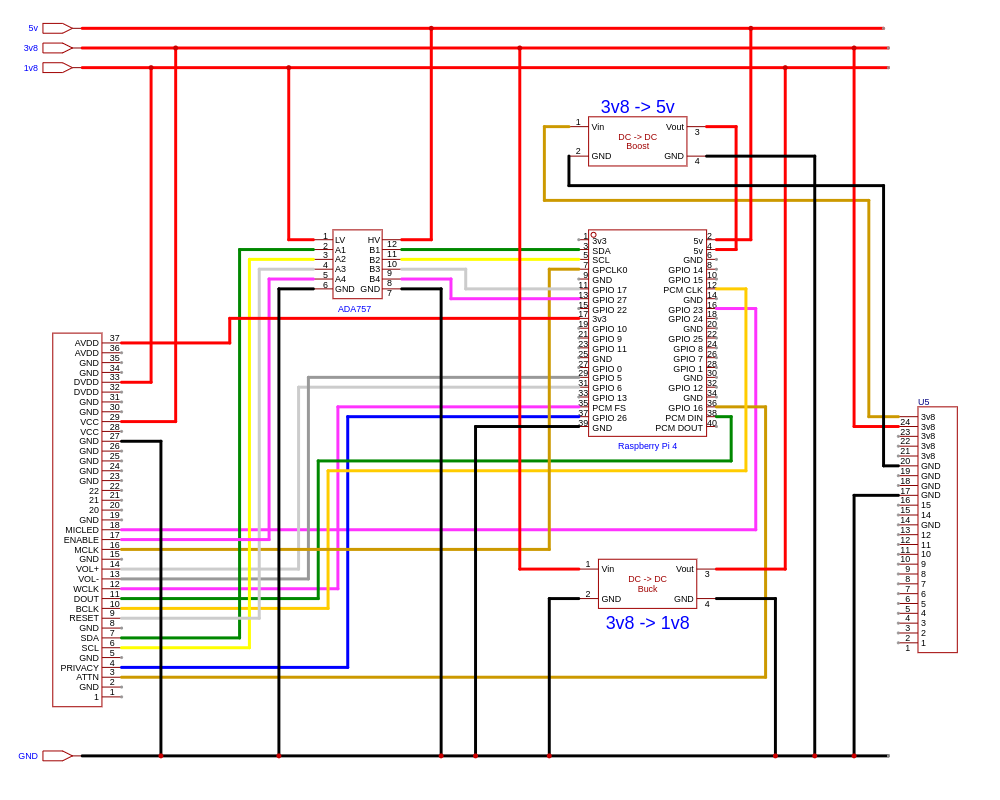
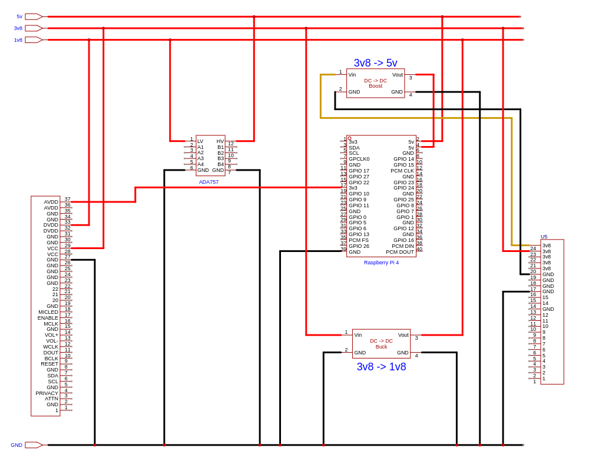
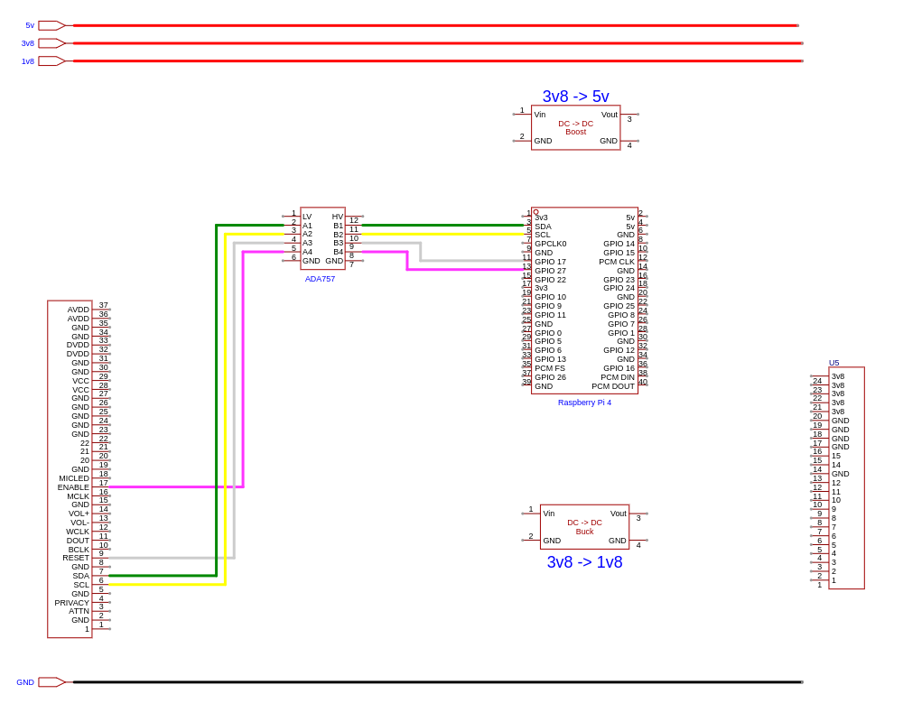
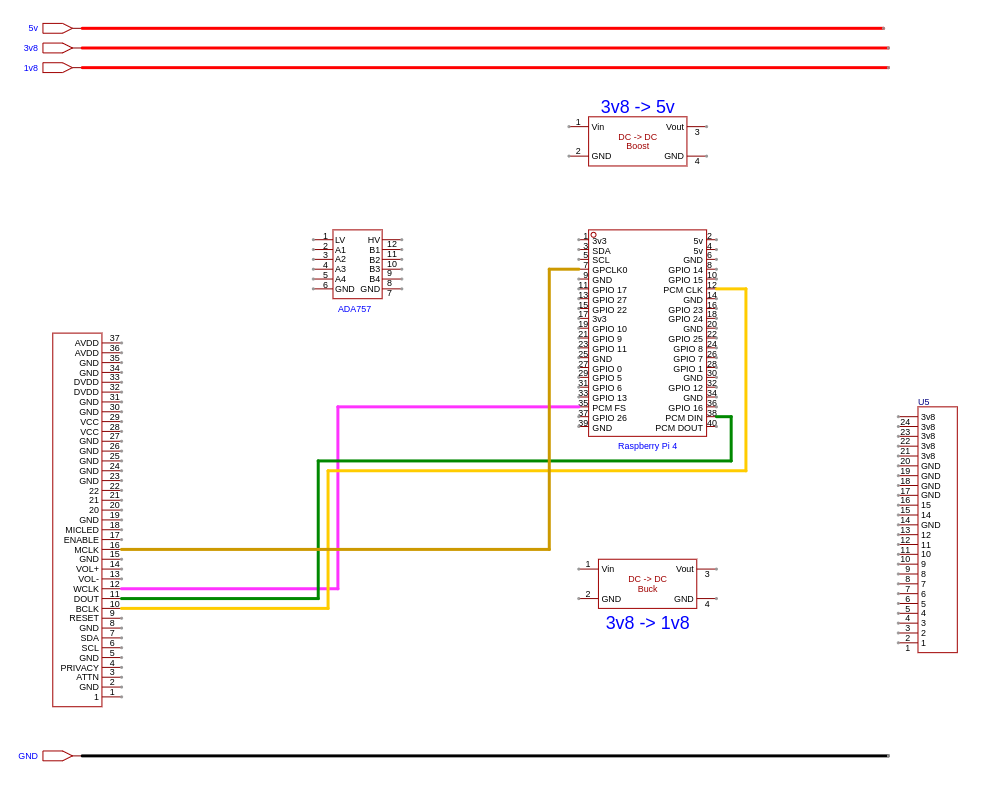
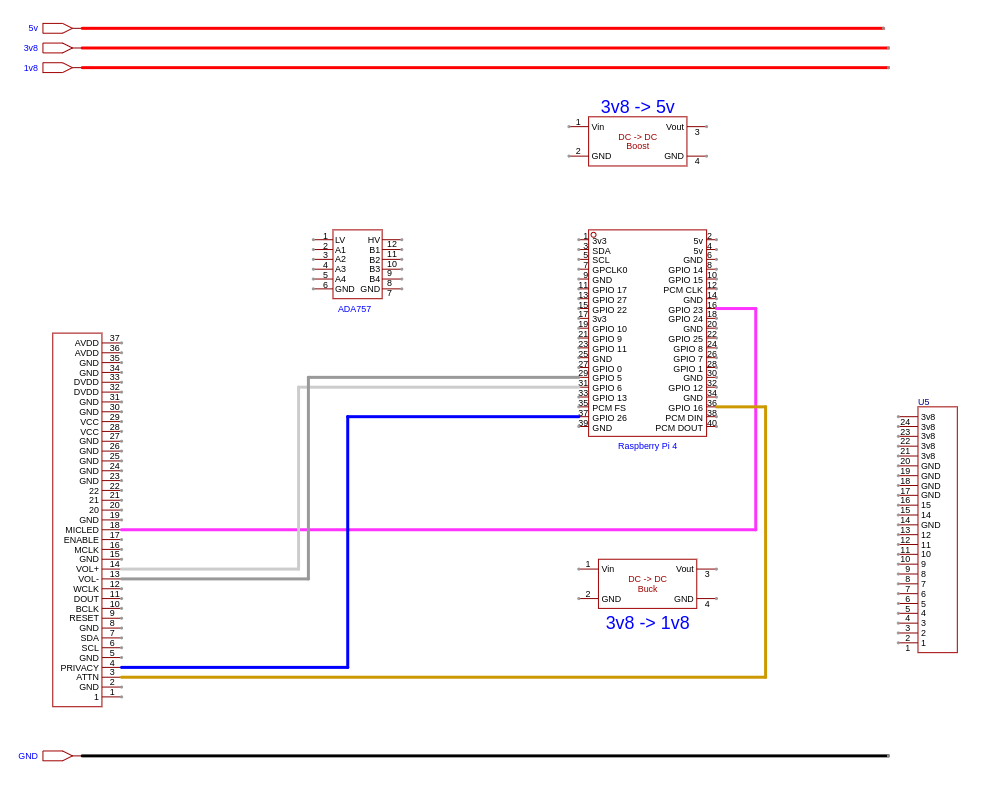

# Wiring

Above is an image of the Microphone/LED board and an image of the Amplifier/Power board from a 2nd generation Amazon Echo model number XC56PY. The LED board is also used in the 2nd generation Amazon Echo Dot model number RS03QR. The wiring diagrams are only valid for those models.

The images show the numbering system I use for the FFC/FPC connecters in the wiring diagrams.

## Full circuit

Above is a complete circuit diagram. To make it easier to follow I have split it into four separat parts below.

## Power

The Amp/Power Board only supplies 3.8v but the LED Ring requires a 3.8v, 3.3v and a 1.8v supply. In addition to this a 5v supply is needed for logic level shifters. If you are powering the Pi independently then this is supplied by the Pi.

To achieve this, a DC-DC buck convertor is used to step down the 3.8v to 1.8v. The 3.3v is supplied by the Raspberry Pi. If, and only if, you decide to power the Raspberry Pi from the Echo parts then a DC-DC boost convertor is used to step the 3.8v up to 5v. Otherwise the 5v supply is provided by the Pi.

**DO NOT USE THE BOOST CONVERTOR IF THE PI IS INDEPENDENTLY POWERED**

## Control

The Pi operates on 5v logic levels and the chips on the LED board operate at 1.8v so a logic level shifter capable of handling I2C needs to used. The one I am using is from Adafruit and uses 4 BSS138 FETs.

This circuitry is all that is needed to make use of the LED Ring.

## Audio Input (Microphones)

This is where the problems begin.

As previously stated, the Pi uses 5v logic levels and the LED Board uses 1.8v so a logic level shifter should be used between the I2S lines on the Pi and the I2S lines on the Led Board. However, I have been unable to find one that will work with I2S. I have tried a couple but haven't found one yet. As a result I have directly connected the I2S.

When the I2S lines are directly connected, the voltage on the 1.8v bus increases to about 2.3v. This may cause a problem with the TLV320ADC3201. According the specifications the **Recommended Operating Conditions**
this should be a maximum of 1.95v, however, the **Absolute Maximum Ratings** have this as 2.5v with the following caveat:

> Stresses beyond those listed under _Absolute Maximum Ratings_ may cause permanent damage to the device. These are stress ratings only, and functional operation of the device at these or any other conditions beyond those indicated under _Recommended Operating Conditions_ is not implied. Exposure to absolute-maximum-rated conditions for extended periods may affect device reliability.

## Miscellaneous

The final connections are for the volume, attention and privacy buttons. The extra conection controls the red privacy LED. When this is on all microphones are disabled.

